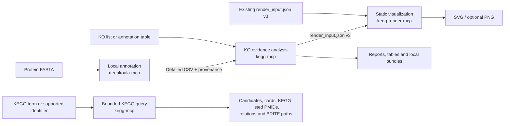

# KEGG MCP

**From protein FASTA or KO evidence to traceable KEGG reports and static diagrams—locally.**

KEGG MCP is a local toolkit that lets researchers use Codex to annotate protein sequences,
inspect supplied KEGG Orthology (KO) evidence, explore bounded KEGG references, and produce
traceable, versioned, and inspectable reports and graphics. You describe the biological question
in natural language; the suite routes the work through focused local tools and keeps the evidence,
provenance, and stable output files together. MCP stands for Model Context Protocol: it is the
local interface that lets Codex call those tools.

It is not a website or hosted analysis service. Protein files, annotation tables, caches, and
generated results stay inside operator-configured local roots. Live KEGG modes still make bounded
reference requests to the configured KEGG endpoint; `offline_cache` mode makes none.

> [!IMPORTANT]
> **Project status:** Alpha. The implemented suite supports Linux with Python 3.11.x only. The
> unified Codex installation remains release-gated until the exact candidate passes the documented
> real-Codex new-task smoke and [release-readiness checklist](docs/release-readiness.md). Use a
> reviewed release checkout or source archive when evaluating the installer.

> [!NOTE]
> Results describe annotation evidence and KEGG reference relationships. They do not prove
> experimental function, pathway presence, activity, completeness, flux, phenotype, or statistical
> enrichment.

[What it does](#what-can-you-do-with-it) · [Example requests](#example-requests) ·
[Interpret the results](#how-to-read-the-results) · [Quick start](#quick-start-with-codex) ·
[Documentation](#documentation)

## What can you do with it?

KEGG MCP is designed for practical questions such as:

- Which selected or named KEGG MODULE definitions are exactly satisfied by my accepted KO evidence?
- How much of a named KEGG pathway's KO reference set overlaps my annotations?
- Which assignments were accepted, uncertain, rejected, duplicated, or conflicting?
- How do two to ten KO sets differ deterministically?
- Which KEGG candidates match a search term or supported external identifier?
- Which PubMed identifiers does KEGG explicitly list for selected entries, without retrieving the
  papers?
- How are selected KEGG entities connected through typed database relationships or BRITE paths?
- Can I preserve selected KEGG references or prepare a local input file for a supported KEGG
  Mapper or KEGG Syntax route?
- Can I turn the analysis into bounded static SVG or PNG diagrams?

### Start from what you already have

| You have | What the suite can do | What you get |
| --- | --- | --- |
| A protein FASTA | Run a configured local DeepKOALA annotation, preserve its detailed evidence, continue into KO analysis, and optionally render selected targets | Detailed annotation CSV, run provenance, analysis reports, tables, and optional graphics |
| A K-number list or CSV/TSV annotation table | Skip sequence annotation; normalize the supplied evidence and analyze MODULEs, pathway KO coverage, or KO-set differences | Human-readable report plus versioned, inspectable TSV and JSON artifacts |
| A KEGG search term or supported gene, organism, or substance identifier | Search candidates, retrieve typed entry cards where supported, resolve identifiers, trace allowlisted relations, or map BRITE paths | Bounded results that retain ambiguity, unmapped outcomes, and retrieval provenance |
| Selected KO, MODULE, pathway, reaction, enzyme, compound, glycan, gene, or genome entries | Retrieve typed cards or only the PubMed identifiers explicitly listed by KEGG, then optionally preserve a selected snapshot | Bounded previews or a durable reference bundle; papers are not retrieved or summarized |
| Caller-supplied data for a supported KEGG Mapper or KEGG Syntax route | Validate and serialize one of seven closed input formats without contacting or running the external service | One local target-specific data file plus `handoff_manifest.json` |
| A compatible `render_input.json` version 3 | Skip annotation and analysis; render the completed handoff | Static SVG and optional PNG files plus a render manifest |

## How it works



The diagram represents three independent local MCP servers: DeepKOALA, Core, and Renderer. Codex
users normally make one request. Three focused repository-scoped Skills carry stable, versioned
files between stages and continue the original goal. If you already have KO evidence, the
DeepKOALA stage is skipped. If you only need a KEGG lookup, the request goes directly to the Core.
Rendering is always optional.

## What does a result look like?

A full FASTA-to-graphics request can produce:

| Stage | Main files | Why they matter |
| --- | --- | --- |
| Annotation | `deepkoala_annotations.csv`, `deepkoala_run_report.md` | Detailed source evidence plus the actual model, model date, device, parameters, and run provenance |
| Analysis | `analysis_report.md`, `normalized_annotations.tsv`, `protein_ko_mapping.tsv` | A readable summary and inspectable evidence tables rather than an unexplained KO set |
| MODULE and pathway results | `module_completion.tsv`, `module_ranking.tsv`, `pathway_coverage.tsv`, `pathway_ranking.tsv` | Exact MODULE evaluation and descriptive pathway reference overlap, reported separately |
| Stable handoff | `render_input.json`, `bundle_manifest.json` | A versioned renderer input and integrity-recorded analysis bundle |
| Durable KEGG reference | `reference_snapshot.json`, `relationships.tsv`, optional `brite_paths.tsv`, `reference_manifest.json` | A selected card or references snapshot that can survive the stdio session without exporting the KEGG cache |
| External-tool input | One target-specific data file and `handoff_manifest.json` | Validated local input for one supported KEGG Mapper or KEGG Syntax route; nothing is uploaded or executed |
| Graphics | target `.svg` or `.png` files, `render_manifest.json` | Static evidence overlays or MODULE logic diagrams with rendering provenance |

Not every request creates every file. Query-only workflows return bounded previews and
current-stdio-session retained detail, which expires and is deleted on normal server shutdown.
For the nine card-supported entry types, `projection="references"` extracts only PubMed identifiers
explicitly present in KEGG `REFERENCE` fields. It does not retrieve, read, or summarize papers.

A still-valid card or references snapshot can be exported in full or as a selected subset, with
one optional current-scope BRITE result, through `write_kegg_reference_bundle`. The local export
makes no KEGG request and is neither a cache export nor a KEGG mirror.

`prepare_kegg_handoff` supports exactly seven local targets: KEGG Mapper Reconstruct, Search,
Color, Join, and MWsearch; KEGG Syntax KO Composition; and caller-ordered KO Sequence. It validates
and serializes input without a KEGG request, upload, browser launch, external execution, or result
parsing. KO Sequence order must be supplied by the caller; Core does not infer genomic order or
coordinates.

The Renderer supports regular canonical `koNNNNN` pathway overlays and project-owned MODULE logic
diagrams. Global and overview pathway overlays are unsupported; `map` and organism-specific
pathway targets remain summary-only rather than renderable.

Output directories must be new or empty. Published files are not overwritten, and the manifest is
written last so a completed bundle is distinguishable from an interrupted one.

## Example requests

Once the suite is installed and the paths are inside configured roots, prompts can stay focused on
the research task.

### Protein FASTA to report and graphics

> Annotate `/absolute/project/inputs/proteins.faa` as an isolate proteome. Analyze the resulting KO
> evidence, select up to five MODULEs and up to five canonical KO reference pathways by KO overlap,
> write the analysis to `/absolute/project/analysis/run-001`, and render the selected targets as
> SVG. Report the resolved DeepKOALA model version.

### Existing KO evidence

> Analyze `/absolute/project/inputs/mag-ko.tsv` as a MAG. Report strict and lenient evidence
> separately, and explain exact MODULE completion separately from project block coverage.

### KEGG candidate search

> Search KEGG Orthology for `citrate synthase`. Preserve every candidate without choosing a best
> match, then retrieve typed cards for the identifiers I select.

### KEGG-listed literature references

> For KO entry `K00844`, return only the PubMed identifiers explicitly listed in its KEGG
> `REFERENCE` fields. Do not retrieve, read, or summarize the papers. Export the resulting snapshot
> to `/absolute/project/analysis/k00844-reference`.

### Prepare a supported external-tool input

> Prepare a KEGG Mapper Color handoff that sets the background color of `K00844` to `#FF0000`, and
> write it to `/absolute/project/analysis/mapper-color`. Do not contact KEGG, upload the result,
> open a browser, run Mapper, or parse a result.

### KO-set comparison

> Compare `/absolute/project/inputs/sample-a.tsv` and
> `/absolute/project/inputs/sample-b.tsv`. Report shared and set-specific KO evidence as
> deterministic set differences without statistical claims.

### Render an existing analysis

> Render `/absolute/project/analysis/run-001/render_input.json` as SVG and PNG into a new images
> directory. Do not repeat the biological analysis.

Tell the suite whether the analysis unit is an isolate genome, MAG, isolate proteome, pangenome,
or metagenomic community when that context is known. Pangenome and metagenomic-community results
describe pooled encoded potential; they cannot be attributed to one isolate.

## How to read the results

| Result | Safe interpretation | What it does not establish |
| --- | --- | --- |
| K-number assignment | Annotation evidence retained under its reported source and input policy | Experimental validation or proof that a rejected function is absent |
| Strict evidence view | Records classified as accepted by the named normalization policy | A universal confidence threshold across annotation systems |
| Lenient evidence view | Accepted records plus only policy-defined uncertain records | Permission to include rejected or merely below-threshold predictions |
| Exact MODULE completion | Whether the supported KEGG MODULE logic evaluates true for the selected evidence | Pathway activity, flux, or phenotype |
| Project block coverage | Completed required top-level blocks divided by all required blocks, reported only when every required block is evaluable | Official KEGG completeness or a substitute for exact completion |
| Pathway KO coverage | Unique selected KOs overlapping an explicit KEGG reference denominator | Pathway presence, completeness, expression, activity, flux, phenotype, or enrichment |
| Search, relation, or BRITE result | A candidate, cross-reference, or descriptive classification supplied by KEGG | Confirmed identity, regulation, causality, mechanism, or dominant function |
| KO-set comparison | Deterministic set intersection and difference | Statistical differential function |

Unsupported MODULE syntax is preserved rather than guessed. A block can remain unevaluable with a
reason, and the aggregate result distinguishes `partially_evaluable` from `not_evaluable`.
Ambiguous identifiers, organism mismatches, missing mappings, duplicate evidence, and truncation
remain visible instead of being silently resolved.

## Is this the right tool?

KEGG MCP is a good fit when you:

- have protein FASTA, KO identifiers, or annotation tables and want a traceable KEGG-oriented
  workflow;
- want Codex to coordinate the stages without manually copying intermediate data;
- need source decisions, thresholds, multiple assignments, ambiguity, and provenance to survive
  analysis;
- prefer bounded local files and explicit network access over a hosted multi-user service; and
- work on Linux with an operator-managed Python 3.11.x and KEGG access configuration.

It is not designed to provide:

- nucleotide gene calling, translation, sequence alignment, or unrestricted genome annotation;
- statistical enrichment, differential abundance, abundance weighting, replicate-aware analysis,
  metabolic modeling, or flux and phenotype prediction;
- arbitrary graph traversal, causal-network analysis, or non-KEGG backends;
- a web UI, remote HTTP server, public hosting, or multi-user result storage;
- automatic downloads of later DeepKOALA models, HMMER, KOfam profiles, or KEGG datasets; or
- a KEGG mirror or redistribution path for KEGG payloads and derived pathway images.

## Quick start with Codex

The complete Codex path uses the repository suite installer. It creates three locked runtimes,
copies the three canonical Skills into one generated local plugin, and registers three absolute
stdio launch commands while keeping every process and state root independent.

### Requirements

- Linux with a CPython 3.11.x executable
- `uv` 0.11.16 or later with locked-sync support
- Git
- A Codex CLI that supports local plugin commands
- A reviewed release checkout or source archive
- Existing absolute, non-symlink private-state and project input/output directories
- A not-yet-created installation root beneath an owner-only, writable, non-symlink parent directory
- One explicit KEGG access mode

Follow [Installation and operation](docs/installation.md) to create the owner-only directories,
copy [`examples/config/kegg-mcp-suite.toml`](examples/config/kegg-mcp-suite.toml) to a private
location, replace every placeholder, and protect the deployment file with mode `0600`.

Choose one access mode:

- Use confirmed `public_academic` only when both the user and the work qualify for public academic
  KEGG REST access.
- Use `licensed` with an appropriately authorized HTTPS endpoint for other live deployments.
- Use `offline_cache` when the deployment must issue no KEGG HTTP requests and an eligible local
  cache already exists.

### 1. Run the non-mutating preflight

```bash
/absolute/path/to/python3.11 \
  /absolute/path/to/kegg_mcp/scripts/install-suite.py \
  --config /absolute/private/kegg-mcp-deployment.toml \
  --install-root /absolute/private/kegg-mcp-install \
  --python /absolute/path/to/python3.11 \
  --uv /absolute/path/to/uv \
  --git /absolute/path/to/git \
  --codex /absolute/path/to/codex \
  --dry-run
```

Preflight validates the source tree, external tools, configuration, filesystem boundaries, and
Codex registration conflicts without creating a persistent installation.

### 2. Install the complete suite

After preflight passes and after confirming the one-time DeepKOALA installation for this new suite
root, run:

```bash
/absolute/path/to/python3.11 \
  /absolute/path/to/kegg_mcp/scripts/install-suite.py \
  --config /absolute/private/kegg-mcp-deployment.toml \
  --install-root /absolute/private/kegg-mcp-install \
  --python /absolute/path/to/python3.11 \
  --uv /absolute/path/to/uv \
  --git /absolute/path/to/git \
  --codex /absolute/path/to/codex \
  --allow-deepkoala-install
```

`--allow-deepkoala-install` authorizes one clone of the official DeepKOALA repository and
installation of its upstream requirements for a new suite root. Dependency resolution for the
three checked-in lockfiles is offline by default. A separate
`--allow-locked-dependency-downloads` option permits only missing artifacts selected by those
lockfiles and their declared build requirements.

DeepKOALA defaults to the bundled `202502` resources, the `cpu` device, and single-domain mode.
GPU execution requires an explicit request and a readiness check that permits CUDA. Multi-domain
execution remains off unless the operator has separately configured local HMMER and KOfam
resources, the companion reports both `allow_multi=true` and `multi_ready=true`, and the user
explicitly requests it. The suite does not download those resources or update DeepKOALA models.

### 3. Open a new Codex task

A successful installation reports:

```json
{
  "new_task_required": true,
  "current_task_reload_supported": false,
  "repeat_installation_required": false
}
```

Close the installation task and open one new Codex task outside this source checkout. The
installation task cannot hot-load newly registered tools, so do not reinstall a suite that Codex
already reports as enabled. Follow the
[post-install verification](docs/installation.md#minimal-post-install-verification) before judging
discovery.

## The three components

| Component | Plain-language role | Stable output |
| --- | --- | --- |
| `deepkoala-mcp` | Optional FASTA front end: runs one controlled local DeepKOALA annotation job | `deepkoala_annotations.csv` and `deepkoala_run_report.md` |
| `kegg-mcp` | Core evidence engine: normalizes annotations, performs bounded KEGG queries, evaluates MODULE logic, calculates descriptive pathway KO coverage, compares KO sets, and writes reports | Analysis bundle, query results, reference/input bundles, and `render_input.json` |
| `kegg-render-mcp` | Optional presentation stage: validates the Core handoff and renders static pathway overlays or MODULE logic diagrams | SVG/PNG artifacts and `render_manifest.json` |

The Core writes `render_input.json` version 3 and preserves
`AnalysisExecutionProvenance` version 3 in output-bundle schema version 3. The Renderer consumes that
authoritative handoff without recomputing annotation normalization, MODULE completion, or pathway
coverage.

Under the hood, the eighteen Core tools cover high-level KO analysis, bounded KEGG search and
retrieval, KEGG-listed PubMed identifier extraction, identifier resolution, relation tracing,
BRITE mapping, evidence audits, local reference comparison, durable reference and external-input
handoffs, scoped result lifecycle, connectivity, and status. See the
[Core MCP server](docs/mcp-server.md) for exact schemas and limits.

## Local data and KEGG access

- Input files and generated artifacts remain in configured local roots and are never uploaded as
  files. Live modes may send the bounded identifiers, search terms, and parameters required by the
  selected KEGG request; `offline_cache` sends none.
- Live `public_academic` or `licensed` modes make only typed, bounded requests. Core and Renderer
  share one deployment-wide no-burst rate budget that never exceeds three KEGG requests per
  second.
- `offline_cache` never falls back to the network. A missing cache entry is a technical cache miss,
  not evidence that a biological entity is absent.
- File access is restricted by Core, Renderer, and DeepKOALA input/output allowlists. Traversal,
  symlink escapes, unsafe ancestry, replacement races, oversized inputs, and unbounded output are
  rejected.
- Cached KEGG responses, pathway PNG/KGML assets, and rendered derivatives must stay out of version
  control, packages, examples, CI artifacts, and releases. Redistributing KEGG-derived graphics
  requires a separate rights review.
- The MIT source license grants no rights to KEGG content, DeepKOALA weights, KOfam profiles, or
  other third-party material.

Review the [KEGG API documentation](https://www.kegg.jp/kegg/rest/) and
[KEGG legal notice](https://www.kegg.jp/kegg/legal.html) before live use.

## Other installation paths

For Codex, the suite installer is the supported path because it installs the matched Skills,
servers, locked runtimes, and registrations together.

A Python wheel contains one MCP distribution only; it does not install either companion or any
repository-scoped Skill. **Installing a wheel alone does not make repository-scoped Skills
available.** Other MCP clients can install the three distributions independently and register
their stdio commands manually:

- [Manual component deployment](docs/manual-component-deployment.md)
- [Core distribution reference](docs/core-package.md)
- [DeepKOALA companion](companions/deepkoala-mcp/README.md)
- [Renderer companion](companions/kegg-render-mcp/README.md)

## Documentation

### Start here

- [Installation and operation](docs/installation.md)
- [Synthetic examples](examples/README.md)
- [Troubleshooting](docs/troubleshooting.md)

### Understand the analysis

- [Import and evidence contracts](docs/import-contracts.md)
- [MODULE evaluation](docs/module-analysis.md)
- [Pathway coverage and deterministic functional comparison](docs/pathway-comparison-analysis.md)
- [Services, results, and reporting](docs/services-results-reporting.md)
- [KEGG client, access, and cache](docs/kegg-client.md)

### Architecture and release contracts

- [Cross-component architecture](docs/architecture.md)
- [Visualization architecture](docs/visualization-architecture.md)
- [Core MCP tools and resources](docs/mcp-server.md)
- [Codex Skill release evaluation](docs/skill-evaluation.md)
- [Release readiness](docs/release-readiness.md)

## Development

### Repository map

| Path | Contents |
| --- | --- |
| `src/kegg_mcp/` | Core domain, importers, KEGG client, analysis, reporting, services, storage, and MCP transport |
| `companions/deepkoala-mcp/` | Independently packaged local annotation companion |
| `companions/kegg-render-mcp/` | Independently packaged static renderer |
| `.agents/skills/` | The three canonical repository-scoped Codex Skills |
| `scripts/` | Unified suite installer and installed-runtime launcher |
| `examples/` | Synthetic KO inputs and placeholder-only deployment templates |
| `docs/` | User, operator, architecture, and release documentation |
| `tests/` | Offline unit, contract, integration, Skill, release, and governed live tests |

The runtime stack is CPython 3.11, local stdio MCP, Pydantic 2, and AnyIO 4. Development uses
`uv`, Ruff, Pyright, and pytest. Each distribution keeps its own lockfile, runtime, entry point, and
release review.

The normal offline validation profile is:

```bash
uv run ruff check .
uv run ruff format --check .
uv run pyright
uv run pytest
```

Pull-request CI additionally runs the governed, serialized live KEGG compatibility campaign. It is
an access and compatibility check, not permission to redistribute responses. See the
[live-test guide](tests/live/README.md).

## License

Project source is available under the [MIT License](LICENSE). KEGG content, DeepKOALA code and
weights, KOfam profiles, and other third-party assets retain their own terms.
