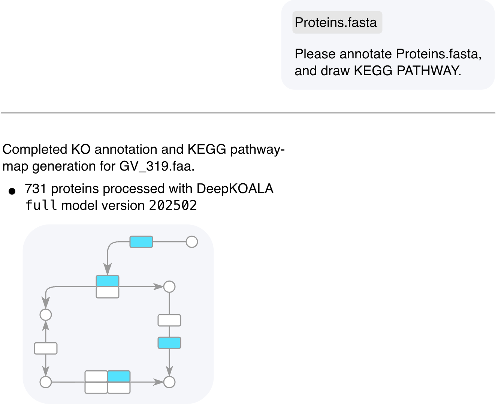

# KEGG MCP

**Ask Codex to turn protein FASTA or KO evidence into traceable KEGG reports and optional
graphics—locally.**

KEGG MCP helps researchers annotate protein sequences, inspect existing KEGG Orthology (KO)
evidence, and explore selected KEGG references through natural-language requests. It keeps the
evidence, decisions, provenance, and generated files together so results can be reviewed instead
of treated as a black box.

MCP stands for Model Context Protocol: it is the local interface that lets Codex call the tools in
this suite. KEGG MCP is not a website or hosted analysis service.

> [!IMPORTANT]
> **Project status:** Alpha. The complete suite targets Linux and native Apple Silicon macOS 14 or
> later with Python 3.11.x. Windows users should use WSL2; native Windows and Intel macOS are not
> supported. Unified installation remains release-gated, so use a reviewed release checkout and
> follow the [installation guide](docs/installation.md).

> [!NOTE]
> Results describe annotation evidence and KEGG reference relationships. They do not prove
> experimental function, pathway presence or activity, flux, phenotype, or statistical
> enrichment.

## One request, traceable results

<p align="center">
  
</p>

<p align="center"><em>One request coordinates the stages. Actual results depend on the input,
annotation setup, and selected KEGG references.</em></p>

## What can you do with it?

Start from the material you already have:

| You have | KEGG MCP can | You get |
| --- | --- | --- |
| A protein FASTA | Run a configured local DeepKOALA annotation to produce KO evidence, then analyze it | Annotation evidence, a readable analysis, inspectable tables, and optional graphics |
| A K-number list or annotation table | Skip sequence annotation and go directly to MODULE evaluation, descriptive pathway KO coverage, or KO-set comparison | A report plus traceable CSV, TSV, and JSON results |
| A KEGG term or supported identifier | Search candidates, inspect selected entries, and retain ambiguity instead of silently choosing a match | Limited, traceable query results with retrieval details |

Less common workflows can also retrieve PubMed identifiers explicitly listed by KEGG, trace KEGG
relationships with explicit relationship types, preserve selected references, and prepare validated
local input files for supported KEGG Mapper or KEGG Syntax routes. See the
[Core MCP reference](docs/mcp-server.md) for the complete capability list.

## What do the results look like?

A request can produce three kinds of output:

- **A readable report** that explains what was analyzed and summarizes the main results.
- **Inspectable evidence files** in CSV, TSV, or JSON format, including decisions and provenance.
- **Optional static graphics** in SVG or PNG format for selected pathway overlays or MODULE logic.

Not every request creates every output. If you already have KO evidence, the optional DeepKOALA
step is skipped. Rendering is always optional.

## Is this the right tool?

### A good fit

- You have protein FASTA, KO identifiers, or annotation tables.
- You want Codex to coordinate a reproducible KEGG-oriented workflow.
- You need ambiguity, multiple assignments, thresholds, and provenance to remain visible.
- You prefer local files and explicit network access over a hosted multi-user service.

### Not designed for

- Gene calling, translation, sequence alignment, or unrestricted genome annotation.
- Statistical enrichment, differential abundance, metabolic modeling, flux, or phenotype
  prediction.
- Non-KEGG databases, arbitrary graph traversal, or causal-network analysis.
- A web UI, public hosting, multi-user storage, or redistribution of KEGG content.

## Try it

Once the suite is installed and your files are inside folders allowed by your local configuration,
prompts can focus on the research task.

### Protein FASTA

> Annotate `/absolute/project/inputs/proteins.faa` as an isolate proteome. Analyze the resulting KO
> evidence, summarize selected MODULE results and descriptive pathway KO coverage, and render
> selected results as SVG. Report the resolved DeepKOALA model version.

Expected files include `deepkoala_annotations.csv`, `deepkoala_run_report.md`,
`unique_accepted_kos.tsv`, `analysis_report.md`, `render_input.json`, selected SVG files, and
`render_manifest.json`. Exact target files depend on the selected MODULEs and pathways.

### Existing KO evidence

> Analyze `/absolute/project/inputs/mag-ko.tsv` as a MAG. Use accepted K numbers only, and explain
> exact MODULE completion separately from pathway KO coverage.

Expected Core bundle files include `unique_accepted_kos.tsv`, `analysis_report.md`, and
`render_input.json`; full record evidence is available only from the separate normalization or
audit workflow.

### Existing render handoff

> Render the selected targets from `/absolute/project/results/render_input.json` as SVG. Preserve
> the Core evidence and calculations unchanged.

Expected renderer files are the selected static SVG artifacts plus `render_manifest.json`.

### KEGG candidate search

> Search KEGG Orthology for `citrate synthase`. Preserve every candidate without choosing a best
> match, then retrieve details only for the identifiers I select.

More synthetic examples are available in the [examples guide](examples/README.md). Tell the suite
whether the analysis unit is an isolate genome, MAG, isolate proteome, pangenome, or metagenomic
community when that context is known.

## Get started

### Install with Codex or ChatGPT

The easiest path is to give this repository to an assistant that can access your local files and
terminal.

1. Copy the repository URL:

   ```text
   https://github.com/zhaoxi120/kegg_mcp
   ```

2. Paste it into Codex, or into a ChatGPT workspace with local terminal access, together with this
   request:

   > Install KEGG MCP from this repository. Follow `docs/installation.md` exactly. Find a reviewed
   > release checkout and stop if none is available. Check that my platform and prerequisites are
   > supported. Before making changes, ask me to confirm the required private directories, my KEGG
   > eligibility and access mode, and any DeepKOALA download. Run the non-mutating preflight first
   > and continue only if it succeeds. After installation, do not reinstall from the current task;
   > tell me how to verify the three repository Skills and their local MCP servers from a new Codex
   > task outside the source checkout.

3. Answer the assistant's questions about local paths, downloads, and KEGG access. When installation
   finishes, open a new Codex task outside the source checkout and try one of the prompts above.

The complete setup currently requires:

- Linux, or native Apple Silicon macOS 14 or later; Windows hosts use WSL2.
- Python 3.11.x, `uv` 0.11.16 or later, Git, and a Codex CLI with local plugin support.
- A reviewed release checkout, private state and project directories, and one explicit KEGG access
  mode.

A ChatGPT workspace with terminal access can help perform the setup, but the installed Skills and
MCP servers are activated in Codex. A standard chat without local file and terminal access can only
explain the installation. For manual setup and operational details, see
[Installation and operation](docs/installation.md).

Use the **suite installer** for the complete Codex setup. The Core and DeepKOALA Python wheels do
not pull in another server distribution. The Renderer Python wheel installs the compatible Core
distribution as a dependency for shared typed contracts and KEGG asset access, but it does not
register or start the Core stdio server. No wheel installs repository-scoped Skills. **Installing a
wheel alone does not make repository-scoped Skills available.** For component-by-component setup,
see [manual deployment](docs/manual-component-deployment.md).

## Interpret the results responsibly

- A K-number assignment is annotation evidence, not experimental validation.
- Exact KEGG MODULE completion evaluates supported reference logic; it does not establish pathway
  activity, flux, or phenotype.
- Pathway KO coverage is descriptive overlap against an explicit reference denominator. It is not
  pathway presence, completeness, activity, or enrichment.
- A search result is a candidate, not an automatically confirmed identity.
- An unmapped identifier or cache miss is not evidence that a biological entity is absent.

Full normalization keeps accepted, rejected, unclassified, invalid, duplicated, and conflicting
evidence distinct where the source and policy support those decisions. Every high-level analysis,
MODULE, pathway, ranking, comparison, and rendering result uses only sorted unique accepted K
numbers. High-level analysis intentionally omits record evidence, protein-to-KO mappings, and
duplicate/conflict accounting; use normalization or audit when those records are required.
Community and pangenome results describe pooled encoded potential rather than one isolate.

The high-level Core workflow applies the same compact analysis semantics to small and large
inputs. An allowed DeepKOALA detailed file is streamed under fixed maxima of 1 GiB, 10 million
source rows, 20 million expanded assignments, and 100,000 unique accepted K numbers. Bounded inline
and other supported inputs produce the same accepted-KO view under their applicable importer
limits. The DeepKOALA companion can validate and publish a detailed CSV up to the same 1 GiB file
ceiling without loading the complete output into memory. Suite installations require Core's
allowed roots to cover every DeepKOALA input and output root; the resource-to-inline recovery route
remains limited to 5,000,000 bytes for manual deployments whose roots are disjoint.

Compact local intake does not raise KEGG request, relationship, reference-loading, ranking, or
output budgets. Very large accepted-KO sets may therefore require explicit MODULE/pathway targets
or division into scientifically independent analysis units instead of automatic Top-N target
mapping.

## Local data and KEGG access

- Input files and generated results remain inside folders allowed by your local configuration. Live
  modes send only the limited identifiers, terms, and parameters needed for the selected KEGG
  request.
- Use confirmed `public_academic` access only when both the user and the work qualify for public
  academic KEGG REST access. Other live deployments need an appropriately licensed endpoint.
- `offline_cache` issues no KEGG HTTP requests and never falls back to the network.
- Cached KEGG responses, pathway assets, and rendered derivatives must remain local and out of
  version control, packages, examples, CI artifacts, and releases.
- The MIT source license does not grant rights to KEGG content, DeepKOALA code or weights, KOfam
  profiles, or other third-party material.

Review the [KEGG API documentation](https://www.kegg.jp/kegg/rest/) and
[KEGG legal notice](https://www.kegg.jp/kegg/legal.html) before live use.

## Documentation

### Start here

- [Installation and operation](docs/installation.md)
- [Synthetic examples](examples/README.md)
- [Troubleshooting](docs/troubleshooting.md)
- [Services, results, and reporting](docs/services-results-reporting.md)

### Understand the analysis

- [Import and evidence contracts](docs/import-contracts.md)
- [MODULE evaluation](docs/module-analysis.md)
- [Pathway coverage and KO-set comparison](docs/pathway-comparison-analysis.md)

### Technical and maintainer references

- [Core package](docs/core-package.md) and [Core MCP tools](docs/mcp-server.md)
- [Cross-component architecture](docs/architecture.md) and
  [visualization architecture](docs/visualization-architecture.md)
- [Manual component deployment](docs/manual-component-deployment.md)
- [Codex Skill evaluation](docs/skill-evaluation.md) and
  [release readiness](docs/release-readiness.md)

## License

Project source is available under the [MIT License](LICENSE). KEGG content, DeepKOALA code and
weights, KOfam profiles, and other third-party assets retain their own terms.
