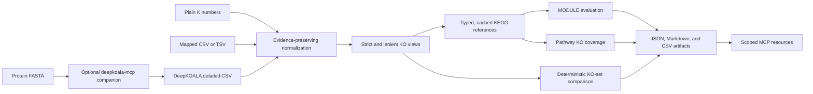

# Repository capabilities and usage guide

This guide describes what the first supported KEGG MCP release can do, how its pieces fit
together, and how to use it safely. It applies to version 0.1.0 as released on 2026-07-15.
Normative edge-case behavior remains defined by the linked contract documents. It also describes
the repository's optional `deepkoala-mcp` 0.1.0 candidate, which is independently installed,
unreleased, and not part of the supported core 0.1.0 release.

## At a glance

KEGG MCP is a local-first Python package, stdio MCP server, and repository-scoped Codex Skill for
working with supplied KEGG Orthology annotations. It turns annotation evidence into normalized KO
sets, typed KEGG mappings, MODULE evaluations, descriptive pathway coverage, deterministic
comparisons, and bounded reports.



The core server does not assign K numbers from sequences. Protein FASTA users can either run an
external annotation tool themselves or explicitly configure the optional DeepKOALA companion and
return its machine-readable KO output through the same core importer.

### Optional DeepKOALA companion candidate

The repository contains a separately installed local stdio companion whose runner process produces
detailed DeepKOALA CSV plus provenance. This is an optional MCP-side distribution, not code
embedded in the Codex Skill or the core server. Its environment, entry point, state, subprocess,
dependencies, and release review remain separate, so the supported core process does not acquire
PyTorch, DeepKOALA, model-weight, HMMER, or KOfam dependencies.

The companion exposes six tools for redacted status, preparation, acknowledged submission, job
status, cancellation, and terminal deletion. Preparation validates and privately copies the FASTA
but starts no inference. Its complete notice identifies the input, interpreter, DeepKOALA source,
model artifacts, requested and resolved device, effective settings, queue disposition, and weight
source. Submission requires the exact notice digest plus `acknowledged=true`; a changed staged
input or execution artifact invalidates the plan.

The candidate is POSIX-only and requires an operator-provided official DeepKOALA checkout, a
separate Python 3.11 interpreter with a working PyTorch runtime, and a private state directory. It
accepts exactly one inline protein FASTA or one absolute regular file under an explicitly allowed
root. Its built-in maxima include 5,000,000 input and output bytes, 100,000 sequences, 100,000
residues per sequence, and 65,536 diagnostic bytes; environment configuration may only lower the
effective bounds reported by runner status.

FASTA validation requires ASCII, non-empty sequences, unique identifiers from the first header
token, uppercase residues from `ACDEFGHIKLMNPQRSTVWYBXZJUO*`, and no whitespace inside residue
lines. A nucleotide-looking input of at least 100 residues is rejected so that nucleotide FASTA is
not silently treated as protein input.

The runner preserves the supported upstream defaults: `device=auto`, `model=full`, `date=latest`,
`batch_size=32`, `num_workers=2`, and `topk=1`. It always requests detailed output and rejects
`multi=true`. `device=auto` may select a GPU; a CPU-only caller must explicitly request
`device="cpu"` and can lower `batch_size`, `num_workers`, and the configured thread limit. Job
concurrency is fixed at one and is not DeepKOALA `batch_size`: the former limits independent
processes, while the latter controls inference batching inside one process.

By default the runner records `github_bundled` for weights already installed in the configured
official checkout. `user_provided` can be selected only as provenance for another already
installed resource set. The companion never downloads or replaces weights and points users to
<https://www.genome.jp/ftp/db/deepkoala/> for upstream updated-weight information.

Successful output and provenance are returned through scoped resources. The client or Skill reads
and verifies any paginated detailed CSV, then passes it inline with the supplied provenance
template to the core `normalize_ko_annotations` importer. One server cannot dereference another
server's private URI. The companion does not normalize KO evidence or interpret predictions.

The Skill may call the companion only after the MCP client discovers and explicitly configures it.
The Skill never contains DeepKOALA inference, subprocess, weight-management, scheduling, or
normalization logic. The companion remains an unreleased candidate, not a core 0.1.0 capability.

## Release profile

| Item | Version 0.1.0 behavior |
| --- | --- |
| Runtime | Python 3.11.x only |
| Distribution | Private GitHub source checkout or reviewed release artifact |
| Transport | Local stdio MCP only |
| Default KEGG mode | Network-disabled `offline_cache` |
| Primary interface | Eight core MCP tools plus result resources |
| Additional interfaces | Public Python contracts and a repository-scoped Codex Skill |
| Optional companion | Independently installed, unreleased `deepkoala-mcp` 0.1.0 candidate |
| Persistent runtime data | User-local KEGG cache and scoped result store |
| Default automated tests | Offline; no live KEGG requests |

The core Python wheel installs only the core MCP server and package. It does not install the
companion, repository-scoped Skill, or complete repository documentation and examples. The
companion has its own environment, lock file, executable, and release review. Use an exact
repository checkout or tag source archive when those assets are required.

## What the repository can do

### Import and preserve KO annotation evidence

The import layer accepts inline UTF-8 text or bytes in three forms:

| Input | Supported behavior |
| --- | --- |
| Plain KO list | One K number per non-empty line; valid user-supplied identifiers become accepted annotation evidence under a named policy. |
| Generic CSV or TSV | Requires an explicit delimiter, column mapping, and decision policy; unmapped columns remain in raw row evidence. |
| DeepKOALA detailed CSV | Imports the documented `name,predict_label,probability,threshold,annotate` fields and optional paired `start,end` coordinates. |

Importers validate exact uppercase `K` identifiers such as `K00001` and normalize an explicit,
case-insensitive `ko:` namespace prefix. They do not extract K numbers from free text or silently
uppercase a lowercase identifier.

Every emitted annotation record can retain:

- sample and sequence identity;
- the raw KO and raw source decision;
- normalized status and a machine-readable reason;
- score type, score, threshold, and threshold rule when supplied;
- rank and one-based inclusive domain coordinates;
- source, importer, software, model, date, and logical input provenance when known; and
- the original logical row fields in source order.

Multiple records for one sequence are valid, including top-k, multi-label, and multi-domain
assignments. Invalid, duplicate, conflicting, rejected, and unclassified rows are reported rather
than silently discarded.

### Build strict and lenient evidence views

The normalized dataset remains the primary evidence. KO sets are deterministic derived views:

- strict evidence contains accepted K numbers only;
- lenient evidence contains accepted plus policy-defined uncertain K numbers; and
- rejected, unclassified, and invalid records never enter the lenient set.

The current DeepKOALA policy does not turn a below-threshold prediction into uncertain evidence;
it preserves it as source-rejected. Generic score and threshold values are never compared unless
their semantics are explicitly defined by the selected policy.

### Retrieve KEGG data through typed operations

The KEGG client exposes bounded `info`, selected `get`, selected `link`, and selected `conv`
operations. It can:

- retrieve selected KO, MODULE, PATHWAY, REACTION, ENZYME, COMPOUND, and supported BRITE entries;
- map selected K numbers to pathways, modules, reactions, EC numbers, or BRITE relationships;
- retrieve pathway-to-KO relationships; and
- convert explicitly supplied KEGG gene identifiers to or from supported NCBI and UniProt
  identifiers.

It is not an arbitrary URL proxy and does not perform unrestricted KO-to-all-genes expansion.
Requests use strict identifiers, response-size limits, endpoint-specific batching, bounded retries,
and a process-wide no-burst rate limiter. A KEGG `get` request contains no more than ten entries.

Successful responses are parsed before caching. Provenance includes the operation, normalized
request-key digest, endpoint class and fingerprint, retrieval and serving times, response digest,
parser version, cache state, and KEGG release when available. Cache integrity or parsing failures
remain explicit errors and are not reinterpreted as biological absence.

### Evaluate KEGG MODULE definitions

The analysis layer tokenizes and parses KEGG MODULE definitions without silently dropping content.
It supports the implemented logical contract for:

- top-level spaces and plus signs as AND;
- commas as OR;
- a leading minus sign as an optional component;
- nested parentheses; and
- references to other M numbers.

Definitions retain source spans and explicit unsupported nodes. Reference resolution is bounded and
records missing references and cycles. Unsupported syntax, unresolved required references, or
other unsafe conditions produce `not_evaluable` with a reason.

For evaluable modules, the project reports two separate measures:

- exact completion: whether the complete logical requirement is satisfied; and
- block coverage: the project-defined fraction of satisfied required top-level blocks.

Results may include bounded minimal missing alternatives. Strict and lenient evaluations are kept
separate, and lenient-only satisfaction retains attribution to uncertain records.

### Calculate descriptive pathway KO coverage

Pathway references are constructed from exact typed KEGG LINK and GET results. The reference
records its namespace, unique linked-KO denominator, exclusions, scope metadata, retrieval
provenance, and calculation version.

Coverage is the number of unique detected reference KOs divided by the recorded number of unique
linked reference KOs. It supports explicit `ko`, `map`, and organism reference contracts in the
core layer. The current KO-only MCP analysis tools accept `ko` and `map`; organism-specific
references remain available only to compatible gene-context services in the core layer. The MCP
tools do not manufacture organism-gene membership. Global and overview pathway analysis requires
explicit opt-in.

Pathway KO coverage is descriptive. It is not evidence of pathway presence, completeness,
expression, activity, flux, phenotype, or statistical significance.

### Compare KO evidence sets

The comparison layer can compare two or more normalized datasets deterministically. The MCP tool
accepts two to ten datasets and can report:

- shared and dataset-specific K numbers;
- bounded pairwise set differences;
- strict or lenient evidence under compatible policies;
- MODULE outcomes evaluated against shared resolved definitions; and
- pathway outcomes evaluated against shared reference denominators.

These are set and outcome differences, not differential abundance, enrichment, or claims of
biological specificity. Incompatible reference provenance should be resolved by recomputing all
datasets against one shared retrieval.

### Render and retain bounded results

The high-level analysis service can run plain-KO import, reference loading, MODULE and pathway
analysis, report rendering, and retention in one call. A successful full report contains:

| Section | Format | Purpose |
| --- | --- | --- |
| `structured` | JSON | Complete typed evidence, analyses, parameters, limits, and provenance. |
| `summary` | Markdown | Concise evidence-aware human-readable report with explicit truncation. |
| `annotations` | CSV | Complete flat annotation-record export within its hard limit. |

Artifacts carry byte counts and SHA-256 digests. Complete JSON and CSV artifacts fail safely when
their configured hard limits are exceeded; they are not silently truncated. Large artifacts can
be read through bounded byte-range resources.

The local SQLite result store isolates results by an opaque process scope. Defaults include
24-hour retention, a 512 MiB logical artifact quota, a 640 MiB main-database page cap, and at most
10,000 active results. Unknown, expired, deleted, and cross-scope identifiers all return the same
safe `RESULT_NOT_FOUND` behavior.

### Guide workflows through the Codex Skill

The instruction-only Skill under `.agents/skills/kegg-mcp/` can route:

- existing K-number lists;
- generic or DeepKOALA annotation tables;
- MODULE or pathway questions;
- deterministic comparison of multiple KO sets; and
- protein FASTA inputs that still need an external or explicitly configured companion annotation
  step.

The Skill selects MCP workflows and applies conservative interpretation rules. It guides FASTA
users to an external annotation step when the optional companion is unavailable. When the MCP
client discovers the explicitly configured candidate, the Skill may orchestrate its tools,
display the complete notice, and transfer verified output to the core importer. The Skill does not
duplicate normalization or analysis logic, implement annotation or job execution, or infer a K
number from a sequence, gene name, or product name.

## MCP tool reference

| Tool | Use it for | Principal MCP bound |
| --- | --- | --- |
| `analyze_ko_annotations` | Normalize inline KO evidence and run requested MODULE and pathway analyses in one call. | Up to 25 MODULE and 25 pathway targets. |
| `normalize_ko_annotations` | Normalize and retain a plain list, explicitly mapped generic table, or DeepKOALA detailed table. | Bounded inline payload; no arbitrary server path. |
| `get_kegg_entries` | Retrieve selected allowlisted KEGG entries with bounded batching. | 1–50 entries per tool call. |
| `map_ko_ids` | Map selected K numbers to pathways, modules, reactions, EC numbers, or BRITE. | 1–100 unique K numbers. |
| `analyze_modules` | Evaluate exact MODULE completion and block coverage from inline or retained evidence. | 1–25 unique MODULE targets. |
| `analyze_pathways` | Calculate descriptive unique-KO coverage using an explicit `ko` or `map` reference namespace. | 1–25 unique pathway targets. |
| `compare_ko_sets` | Compare evidence sets deterministically, optionally with shared-reference functional outcomes. | 2–10 labelled datasets; up to 25 functional targets of each type. |
| `get_server_status` | Inspect redacted capabilities, access mode, transport, and retention limits. | Empty input object. |

Tool responses are bounded previews. Follow the returned resource URI when complete retained detail
is required.

The optional companion has a separate six-tool candidate surface:

| Companion tool | Use it for |
| --- | --- |
| `get_deepkoala_runner_status` | Inspect redacted structural installation inventory, candidate model dates, bounds, defaults, and queue counts; preparation is the authoritative selected-job preflight. |
| `prepare_deepkoala_job` | Validate and privately stage one bounded protein FASTA, then obtain a complete execution notice without inference. |
| `submit_deepkoala_job` | Acknowledge the exact notice digest and start or queue that identity-bound plan. |
| `get_deepkoala_job` | Poll lifecycle state and obtain the successful core-import handoff. |
| `cancel_deepkoala_job` | Cancel a queued job or terminate a running process group. |
| `delete_deepkoala_job` | Delete a terminal job and its retained local artifacts; retry recognition is limited to the bounded process tombstone window. |

## MCP resources

Fixed resources:

- `ko-analysis://status`
- `ko-analysis://cache/info`

Validated resource templates:

- `ko-analysis://results/{result_id}`
- `ko-analysis://results/{result_id}/{section}`
- `ko-analysis://results/{result_id}/{section}/{offset}/{limit}`
- `kegg-cache://entries/{database}/{identifier}`

Result identifiers are opaque and valid only within the stdio server process scope that created
them. The cached-entry resource is offline-only and never causes a network request.

The optional companion independently exposes `deepkoala-job://status` and scoped `output`,
`provenance`, and `diagnostics` resources under
`deepkoala-job://jobs/{job_id}/{section}`. Artifacts larger than 64 KiB use base64 byte-range
resources under `deepkoala-job://jobs/{job_id}/{section}/{offset}/{limit}`, with at most 1 MiB per
page. Clients verify the complete SHA-256 digest before importing output into the core server.

Runner status includes the effective sequence-count, total-residue, per-sequence, and header
limits. Job summaries set `diagnostics_truncated=true` only with a terminal diagnostic resource.
Deletion retries are recognized for the 1,024 most recent process-local tombstones; eviction or a
server restart returns `JOB_NOT_FOUND`, so delete is not unconditionally idempotent.

## Recommended workflows

### Existing K numbers to a report

Use `analyze_ko_annotations` with inline KO text, an explicit analysis unit, and one or more MODULE
or pathway targets. This is the preferred one-call route.

### Annotation table to staged analysis

Use `normalize_ko_annotations` with an explicit table signature, column mapping, and named decision
policy. Review the import report, then pass the retained result to `analyze_modules`,
`analyze_pathways`, or `compare_ko_sets` within the same server scope.

### Several KO sets

Normalize all inputs with compatible policies, then call `compare_ko_sets`. Reuse shared KEGG
references or recompute them together when retrieval provenance differs.

### Protein FASTA without K numbers

Use the Codex Skill for annotation-tool guidance. Without the optional companion, run DeepKOALA,
KofamScan, BlastKOALA, GhostKOALA, or another selected annotator outside the core server, retain
its detailed machine-readable output and version provenance, then return through the
annotation-table workflow.

When the candidate is independently installed and discovered, call companion status, then prepare
the FASTA. Review the entire returned notice; for CPU-only work, require `device="cpu"`, a small
thread limit, and conservative per-job settings. Submit only with the exact notice digest and
explicit acknowledgement, poll until terminal, read and verify the detailed CSV resource, and
pass the decoded CSV plus provenance template inline to the same core importer. The Skill must
never send FASTA to the core `kegg-mcp` server or ask the core server to dereference the companion
resource URI.

### Direct Python integration

Applications can import the public `kegg_mcp.domain`, `kegg_mcp.importers`, `kegg_mcp.kegg`,
`kegg_mcp.analysis`, `kegg_mcp.reporting`, and `kegg_mcp.services` surfaces. Domain and analysis
functions remain independent of MCP transport, and pure analysis functions perform no hidden
network or filesystem I/O.

## Quick start

### 1. Install the locked source environment

Requirements are Python 3.11.x, local writable storage, and an MCP client that can start a stdio
command.

```bash
uv sync --frozen
uv run --frozen pytest
```

Start the protocol server for a manual development check with:

```bash
uv run --frozen kegg-mcp
```

The process waits for MCP JSON-RPC on stdin; it is not a terminal user interface.

### 2. Select a KEGG access mode

Offline mode is the safe default:

```text
KEGG_MCP_ACCESS_MODE=offline_cache
```

Eligible public-academic use requires an explicit operator confirmation:

```text
KEGG_MCP_ACCESS_MODE=public_academic
KEGG_MCP_ACADEMIC_USE_CONFIRMED=true
```

Non-academic use requires an appropriately licensed endpoint:

```text
KEGG_MCP_ACCESS_MODE=licensed
KEGG_MCP_LICENSED_ENDPOINT=https://kegg.example.edu/api
KEGG_MCP_LICENSED_USE_CONFIRMED=true
```

The confirmation values record operator assertions; the project does not determine eligibility or
validate a license. Never put credentials in the endpoint URL.

Optional private SQLite locations can be selected with `KEGG_MCP_CACHE_PATH` and
`KEGG_MCP_RESULT_STORE_PATH`. Cached KEGG payloads and retained results must remain local and out
of source control, packages, examples, CI artifacts, and releases.

### 3. Register the stdio server

Use the exact MCP server name `kegg-mcp`:

```json
{
  "mcpServers": {
    "kegg-mcp": {
      "command": "/absolute/path/to/.venv/bin/kegg-mcp",
      "env": {
        "KEGG_MCP_ACCESS_MODE": "offline_cache"
      }
    }
  }
}
```

Client configuration formats vary. Do not add a remote URL or a shell wrapper. MCP protocol
messages use stdout; diagnostics use stderr.

To use the unreleased companion candidate, install it independently with
`uv sync --project companions/deepkoala-mcp --frozen` and register a second stdio server named
`deepkoala-mcp`. Configure absolute `DEEPKOALA_MCP_CHECKOUT`, `DEEPKOALA_MCP_PYTHON`, and
`DEEPKOALA_MCP_STATE_ROOT` paths. `DEEPKOALA_MCP_ALLOWED_ROOTS` is required only for path-based
FASTA intake; inline FASTA remains available. The candidate is POSIX-only because safe job
cancellation and shutdown require process-group support and pre-execution output bounding requires
file-size-limit support. See the
[installation guide](installation.md#install-the-optional-deepkoala-companion-candidate) for the
full environment contract and CPU-only example.

A minimal companion registration for inline FASTA looks like this:

```json
{
  "mcpServers": {
    "deepkoala-mcp": {
      "command": "/absolute/path/to/kegg_mcp/companions/deepkoala-mcp/.venv/bin/deepkoala-mcp",
      "env": {
        "DEEPKOALA_MCP_CHECKOUT": "/absolute/path/to/DeepKOALA",
        "DEEPKOALA_MCP_PYTHON": "/absolute/path/to/pytorch/bin/python",
        "DEEPKOALA_MCP_STATE_ROOT": "/absolute/private/path/deepkoala-mcp",
        "DEEPKOALA_MCP_WEIGHT_SOURCE": "github_bundled",
        "DEEPKOALA_MCP_CPU_THREADS": "2"
      }
    }
  }
}
```

The server reads its process environment and does not load `.env` files. Add
`DEEPKOALA_MCP_ALLOWED_ROOTS` only when `fasta_path` input is required.

### 4. Verify status

Call `get_server_status` with:

```json
{}
```

Confirm that the reported transport is stdio and the access mode matches the intended
configuration. Status is deliberately side-effect-free: it does not probe KEGG connectivity or
open the configured cache merely to report statistics.

### 5. Normalize a KO list locally

Call `normalize_ko_annotations` in offline mode:

```json
{
  "text": " K00001\nko:K00002\nK00001\nNOT_A_KO\n",
  "analysis_unit": "isolate_proteome"
}
```

The complete normalized dataset is retained under the returned result resource. This local step
does not need KEGG network access.

### 6. Run a combined analysis

With authorized live access or a matching authorized cache, call `analyze_ko_annotations`:

```json
{
  "ko_text": "K00001\nK00002\nK00003\n",
  "analysis_unit": "isolate_proteome",
  "module_ids": ["M00001"],
  "pathways": [
    {
      "pathway_id": "ko00010",
      "reference_namespace": "ko"
    }
  ]
}
```

The identifiers above are syntax examples, not a claim that the KO set represents one real
organism. Read the returned resource index and its `structured`, `summary`, and `annotations`
sections for full retained output.

### 7. Prepare and acknowledge a DeepKOALA companion job

After independently installing and registering the companion, call
`get_deepkoala_runner_status` with `{}`. Status is a redacted structural inventory; preparation is
the authoritative preflight for a selected job, and inference can still fail safely later.

Prepare, but do not yet start, a small CPU-only example:

```json
{
  "fasta_text": ">protein_1\nMKTAYIAK\n",
  "model": "full",
  "model_date": "latest",
  "device": "cpu",
  "batch_size": 1,
  "num_workers": 0,
  "topk": 1,
  "multi": false
}
```

The sequence above is only a FASTA syntax example. For fragmented proteins, explicitly select
`model="frag"`. Preparation privately stages and validates the input and returns a `plan_id`,
expiry, complete execution notice, and `notice_sha256` without starting DeepKOALA. Review and show
the entire notice, including the FASTA digest and summary, resolved model date and device,
interpreter/source/model identities, effective settings, queue disposition, weight source, and
no-download warning.

Only after the operator explicitly accepts that exact notice, call `submit_deepkoala_job` with
the returned values:

```json
{
  "plan_id": "REPLACE_WITH_RETURNED_PLAN_ID",
  "notice_sha256": "REPLACE_WITH_RETURNED_NOTICE_SHA256",
  "acknowledged": true
}
```

Poll `get_deepkoala_job` with the returned `job_id` until it reaches `succeeded`, `failed`,
`cancelled`, or `timed_out`. Use `cancel_deepkoala_job` only for a queued or running job. Use
`delete_deepkoala_job` after a terminal result is no longer needed; retry recognition is bounded
to the current process's recent deletion tombstones.

### 8. Transfer successful output to the core importer

For a `succeeded` job, use the handoff returned by `get_deepkoala_job`:

1. Read its `payload_resource_uri` from the companion.
2. If the resource requires pagination, follow the returned range URIs, base64-decode each page,
   and concatenate the bytes in order.
3. Verify the complete byte count and `output_sha256` before using the CSV.
4. Read and retain the companion provenance and its `source_provenance_template`.
5. Call the core `normalize_ko_annotations` tool with the verified decoded CSV inline:

```json
{
  "text": "REPLACE_WITH_VERIFIED_DETAILED_CSV",
  "input_format": "deepkoala_detailed",
  "source": "REPLACE_WITH_EXACT_SOURCE_PROVENANCE_TEMPLATE"
}
```

The `source` placeholder above means the complete returned JSON object, not a serialized string.
The client or Skill performs this verified transfer because one stdio MCP server cannot
dereference another server's private resource URI. The core importer remains the only component
that applies the named DeepKOALA decision policy; the companion does not interpret KO predictions.

## Scientific interpretation rules

- A K-number assignment is annotation evidence, not experimental validation.
- A source-rejected prediction is not evidence that a function is absent.
- Strict and lenient evidence must remain separate and policy-defined.
- Exact MODULE completion and project block coverage are different measures.
- `not_evaluable` is not the same as incomplete.
- Pathway KO coverage is descriptive and must state its namespace and denominator.
- Community-level results describe pooled encoded potential, not a complete pathway in one
  organism.
- KO-set comparisons are deterministic set differences, not statistical differential function.
- Transport, cache, parser, or authorization errors are not biological absence.

## Explicit non-capabilities

The core version 0.1.0 server does not:

- run DeepKOALA, KofamScan, HMMER, BLAST, or another annotation program;
- assign K numbers from protein or nucleotide sequences;
- perform nucleotide gene prediction, translation, assembly, or alignment;
- perform enrichment, differential abundance, replicate-aware statistics, or confidence intervals;
- infer expression, pathway activity, metabolic flux, phenotype, or experimental validation;
- perform unrestricted KO-to-all-genes expansion;
- generate pathway images, KGML visualizations, or metabolic models;
- redistribute KEGG datasets, KOfam profiles, annotation-model weights, or cache contents;
- host a web UI, remote HTTP service, public annotation service, or multi-user result store; or
- accept arbitrary server-side input or report-output paths through MCP tools.

The optional companion changes only the first two items for a locally configured DeepKOALA
checkout: it may execute bounded protein annotation, but it does not install DeepKOALA, download
weights, enable `multi=true`, run another annotation program, normalize KO evidence, query KEGG,
or make biological claims.

## Validation and release status

Milestones 0 through 8 are implemented. Version 0.1.0 was signed off as the first supported private
GitHub release on 2026-07-15. Its release gates cover offline linting, formatting, strict type
checking, unit/integration/contract/Skill/release tests, clean stdio behavior, distribution audits,
data-rights boundaries, security, and conservative scientific reporting.

The sibling `deepkoala-mcp` 0.1.0 candidate is not covered by that core release sign-off. Its
lightweight package, offline tests, process and resource boundaries, and separate distribution must
pass an independent release review before it is described as supported or released. Live model
compatibility checks are manual, CPU-bounded, and excluded from the default suite.

The default validation commands are:

```bash
uv run --frozen ruff check .
uv run --frozen ruff format --check .
uv run --frozen pyright
uv run --frozen pytest
```

Validate the companion from its own project environment:

```bash
cd companions/deepkoala-mcp
uv sync --frozen
uv run --frozen ruff check .
uv run --frozen ruff format --check .
uv run --frozen pyright
uv run --frozen pytest
```

The default suite must remain offline. A live compatibility check requires separate operator
authorization and should use the smallest explicit request set.

## Further documentation

- [Installation and operation](installation.md)
- [MCP tools, resources, and configuration](mcp-server.md)
- [Annotation evidence and import contracts](import-contracts.md)
- [KEGG client and cache contract](kegg-client.md)
- [KEGG MODULE analysis contract](module-analysis.md)
- [Pathway coverage and comparison contract](pathway-comparison-analysis.md)
- [Services, result storage, and reporting](services-results-reporting.md)
- [Release-readiness checklist](release-readiness.md)
- [Codex Skill evaluation record](skill-evaluation.md)
- [Reviewed development plan](development-plan.md)
- [DeepKOALA companion installation and operation](../companions/deepkoala-mcp/README.md)
