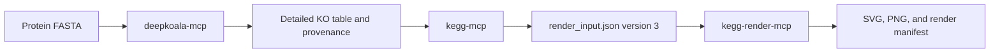

# KEGG Pathway and MODULE Visualization Extension Plan

Status: implemented post-MVP extension

Unified-installer status: assigned and separately release-gated

External interface review dates: visualization sources 2026-07-16; Codex plugin source 2026-07-19

## 1. Purpose

This document defines the implemented bounded local workflow that starts from protein FASTA, produces KO
annotation evidence, performs the existing KEGG-aware analyses, and renders pathway or MODULE
graphics. It defines the component boundaries, data contracts, MCP surfaces, Skill changes,
security requirements, tests, and implementation order needed for that extension.

The extension must preserve the repository's current evidence model and architectural invariants:

- the core `kegg-mcp` server does not execute an annotator;
- annotation evidence is normalized exactly once by the core importers;
- graphics are generated by a separately packaged and isolated renderer MCP process;
- Skills orchestrate typed MCP tools and do not contain inference, normalization, KGML parsing, or
  rendering implementations; and
- visual output does not strengthen biological claims beyond the underlying annotation evidence.

## 2. Executive decision

Implement one user-facing workflow with three independent local stdio MCP processes:



The suite installer may provision the three components together, but they remain separate
processes, locked runtimes, and independently reviewed distributions. The core MCP tool list does
not gain a rendering tool. Its responsibility is to produce a complete, typed renderer handoff
after analysis.

This design gives users an end-to-end FASTA-to-image experience without placing model execution,
binary image processing, or KGML parsing inside the core server.

## 3. Supported scope

The first visualization release supports:

- protein FASTA annotation through an explicitly installed and ready `deepkoala-mcp` companion;
- existing KO lists and annotation tables without running an annotator;
- the existing strict and policy-defined lenient evidence modes;
- regular reference pathway overlays generated from one KEGG pathway image and its matching KGML;
- project-owned MODULE logic diagrams generated from the core MODULE AST and evaluation results;
- SVG as the canonical vector format and PNG as a bounded raster derivative;
- local output bundles and scoped MCP resources; and
- concise legends, provenance, warnings, and evidence-calibrated captions.

The renderer does not support:

- global or overview pathway overlays unless their line-based graphics receive a separately
  reviewed implementation;
- organism-specific pathway claims from KO-only input;
- interactive HTML, JavaScript, a browser screenshot workflow, or a web UI;
- pathway activity, flux, phenotype, enrichment, or metabolic-model inference;
- unbounded bulk pathway rendering; or
- distribution of KEGG PNG, KGML, cache payloads, or real KEGG-derived test fixtures.

## 4. Implementation baseline and resolved contract gap

The repository implements the first two computational stages as follows:

1. `deepkoala-mcp` validates an allowed protein FASTA and a new allowed output directory, starts a
   bounded service-owned `device=auto` execution plan in one atomic request, owns the subprocess
   lifecycle, and returns a stable detailed-CSV handoff after success.
2. `kegg-mcp` imports that detailed table through the source-agnostic importer boundary, applies a
   named decision policy, loads KEGG references, evaluates MODULEs and pathways, writes reports,
   and creates an output bundle.

That output bundle included `render_input.json`, but schema version 1 was a concise preview,
not a sufficient rendering contract. It contained accepted K numbers, truncated pathway
detected-KO previews, and MODULE completion summaries. It does not contain:

- policy-defined uncertain K numbers as a distinct evidence class;
- complete pathway rendering evidence when a preview is truncated;
- full MODULE syntax and reference structure;
- complete required-block states suitable for a logic diagram;
- renderability status and reasons;
- a renderer-specific schema identifier; or
- complete producer and calculation provenance.

The implemented version 3 contract closes those gaps. A renderer never interprets a version 1
preview as a complete KO set or independently repeats the core normalization and
MODULE-evaluation rules.

## 5. End-to-end workflow

### 5.1 Protein FASTA input

1. Discover `deepkoala-mcp` and call `get_deepkoala_runner_status`.
2. Stop with a deployment explanation if the companion is absent or not ready. Do not install or
   download dependencies, model weights, or databases silently.
3. After an explicit user annotation request, call `run_deepkoala_job` once with an allowed
   absolute FASTA path and new allowed output directory. Do not request a second confirmation,
   acknowledgement, workflow digest, or artifact digest.
4. Retain the returned process-scoped job identifier only for bounded status polling. Use the
   completed stable files and returned source provenance for the downstream handoff.
5. After success, pass `annotations_path`, `input_format="deepkoala_detailed"`, and the returned
   source provenance to `kegg-mcp`. If the two clients do not share an allowed root, read the
   bounded annotation resource pages and provide their decoded CSV content instead.
6. Call `analyze_ko_annotations` with an allowed `output_directory` so that the stable analysis
   bundle and `render_input.json` version 3 are written.
7. Pass the absolute `render_input.json` path to `kegg-render-mcp`.
8. Render selected supported targets and return bounded previews plus validated image resources.
9. Delete the terminal DeepKOALA job record only when the user requests cleanup. Delivered CSV
   and Markdown files remain in the user-selected stable output directory.

### 5.2 Existing KO evidence

When the user already supplies K numbers or a usable annotation table, skip the annotation stage.
Run the existing high-level analysis tool and continue from `render_input.json`.

### 5.3 Existing renderer handoff

When a compatible `render_input.json` already exists, validate it and render it directly. Do not
rerun annotation or KEGG analysis unless the user requests a new reference retrieval or the
handoff is incompatible.

### 5.4 Unified Codex deployment boundary

For the Codex app and Codex CLI, `scripts/install-suite.py` is the primary deployment path for all
three stages. It consumes the three checked-in lockfiles, creates separate Core,
DeepKOALA-companion, and Renderer runtimes, and generates one local plugin containing
version-matched copies of the three canonical Skills plus three absolute MCP launch
registrations. Each Skill still declares only its matching server, and no server starts another.

The installer requires a strict deployment TOML that is a direct owner-owned regular file with no
group or other permission bits; mode `0600` is recommended. Its preflight must prove that private
state remains isolated while the configured Core and Renderer roots cover the intended stable-file
handoffs. Private endpoints, suite-managed DeepKOALA paths, and state roots remain in owner-only
installation metadata, not in the plugin directory that Codex may cache.

`uv` runs offline by default. Only the explicit `--allow-locked-dependency-downloads` switch may
allow
`uv` network access while resolving or downloading artifacts required by the checked-in lockfiles
and their declared build requirements. It does not authorize downloading Python, uv, Codex,
repository source, later model weights, KOfam profiles, or KEGG data, and it does not authorize
lockfile updates. The separate `--allow-deepkoala-install` confirmation permits the initial official
DeepKOALA clone and upstream-requirements installation once for each new suite installation root;
the same installed deployment does not ask again for later FASTA jobs. Its bundled `202502` model
is the default.

After successful publication, discovery must be checked in a new Codex task. The generated-plugin
path is not a generic MCP-client installer; other clients use manual component configuration.
The suite installer is the only supported Codex installation path.

## 6. Core `kegg-mcp` changes

### 6.1 Typed renderer handoff

Add a public, transport-independent module:

```text
src/kegg_mcp/services/render_contracts.py
```

It should define immutable Pydantic models with explicit JSON Schema identifiers. A conceptual
top-level contract is:

```text
RenderInput
  schema_version                "3"
  producer                      server name and version
  dataset                       dataset ID, analysis unit, taxonomic context, sources
  decision_policy               name and version
  evidence                      accepted and policy-defined uncertain KO sets
  modules                       bounded ModuleRenderTarget values
  pathways                      bounded PathwayRenderTarget values
  execution                     serializable non-default parameters and versions
```

The contract must not include a workflow digest. All tuples must use deterministic ordering and
all sizes must be bounded.

`VisualizationEvidence` should contain at least:

```text
accepted_ko_ids
uncertain_ko_ids
accepted_count
uncertain_count
```

Rejected, unclassified, and invalid records must not enter either rendering evidence set. Summary
counts may be retained for reporting, but rejected predictions must not be colored as evidence of
absence.

### 6.2 Pathway renderer targets

Each `PathwayRenderTarget` should contain:

- canonical pathway identifier and five-digit pathway number;
- pathway name and class;
- reference namespace and reference scope;
- evidence mode used by the analysis;
- evaluation status;
- descriptive coverage numerator, denominator, and ratio;
- complete detected KO identifiers when retained within the renderer limit, or an explicit
  non-renderable reason;
- reference retrieval and cache provenance;
- calculation method and version; and
- warnings, including global/overview and stale-reference conditions.

The renderer must display the coverage result supplied by the core. It must not recompute or
replace the reported denominator from KGML graphics.

### 6.3 MODULE renderer targets

Each `ModuleRenderTarget` should contain:

- the resolved root MODULE and reachable referenced MODULE definitions;
- the parsed AST, grouping, operator occurrences, reference edges, and unresolved-reference
  issues;
- exact strict and lenient completion results;
- project block coverage, kept separate from exact completion;
- a complete bounded state vector for required top-level blocks;
- optional-component states;
- policy-defined uncertain support that changes lenient results;
- unsupported or not-evaluable content and reasons; and
- parser, resolver, evaluator, retrieval, and cache provenance.

Existing direct results intentionally contain bounded block previews. The rendering handoff needs
a dedicated complete-within-limit block state vector produced by the same core evaluator. If a
MODULE exceeds rendering limits, mark it `not_renderable` with a reason and permit a summary-only
artifact. Do not silently drop blocks or ask the renderer to repeat evaluation logic.

### 6.4 Output bundle integration

Update `write_analysis_bundle` to accept the already-loaded MODULE graphs and pathway references in
addition to the dataset and analysis results. Replace the hand-written JSON dictionary with a
validated `RenderInput` model and canonical serialization.

Introduce a renderer-specific schema version rather than treating the complete output-bundle
version as the renderer schema. Record the renderer schema version and MIME type in
`bundle_manifest.json`.

Before writing files:

- validate graph, reference, and result identity alignment;
- validate target counts and total serialized bytes;
- fail with a dedicated output-limit error instead of writing a partial renderer handoff; and
- retain the existing atomic, owner-only, symlink-safe output behavior.

Version 1 cannot be upgraded losslessly because it contains previews. A renderer receiving version
1 should return a recoverable incompatible-schema error that asks the caller to rerun analysis.

### 6.5 Typed pathway asset retrieval

The KEGG API supports retrieving one pathway PNG or one KGML document per `get` request. Add a
public, transport-independent asset service, for example:

```text
src/kegg_mcp/kegg/pathway_assets.py
```

Suggested contracts:

```text
PathwayAssetKind       image | image2x | kgml
PathwayAssetRequest    canonical pathway ID and requested kind
PathwayAssetResult     bounded bytes, MIME type, and retrieval provenance
```

The implementation should reuse the existing access gate, HTTPS validation, deployment-wide rate
limiter, retry policy, response-size bounds, local cache, and provenance contracts. It must not
accept arbitrary URLs. PNG payloads require bounded structural, decompression, and scanline
validation. The core applies only bounded UTF-8, DTD/entity declaration, and obvious `pathway`
root-prefix preflight checks to KGML bytes, with an independent validator/version identifier; it
must not parse KGML or assert complete XML structure or pathway identity. The renderer owns bounded
XML parsing and identity validation.

This service does not need to become a core MCP tool. The separately installed renderer may depend
on a compatible `kegg-mcp` package version and use this public library interface. If release cycles
later diverge substantially, the shared KEGG access code may be extracted into a separately
reviewed package; it should not be copied into two implementations.

## 7. `deepkoala-mcp` provenance and delivery contract

The companion accepts an allowed absolute FASTA path and a separate new output directory. Its
versioned handoff keeps the biological input distinct from delivered artifacts:

- `ImportHandoff.input_path` and `SourceProvenance.input_path` identify the original FASTA;
- `ImportHandoff.annotations_path` identifies `deepkoala_annotations.csv` for the core importer;
- `ImportHandoff.report_path` identifies `deepkoala_run_report.md`;
- the input, annotation, and report paths are validated independently; and
- no private staged FASTA or raw runner path is returned.

The stable output files are the cross-MCP contract. The companion's process-scoped job and
resource identifiers are only lifecycle and bounded transfer aids.

## 8. New `kegg-render-mcp` companion

### 8.1 Proposed layout

```text
companions/kegg-render-mcp/
├── pyproject.toml
├── README.md
├── src/
│   └── kegg_render_mcp/
│       ├── __init__.py
│       ├── config.py
│       ├── contracts.py
│       ├── render_input.py
│       ├── kgml.py
│       ├── pathway_scene.py
│       ├── module_scene.py
│       ├── svg.py
│       ├── raster.py
│       ├── artifacts.py
│       └── server.py
└── tests/
```

Do not create this tree until its implementation issue is assigned. Every file must be functional
and covered by the corresponding tests when added.

### 8.2 Service boundaries

The renderer should keep parsing, scene construction, rendering, artifact retention, and MCP
transport in separate layers:

```text
validated render input
    -> safe pathway-asset or MODULE-scene model
    -> deterministic scene construction
    -> SVG renderer
    -> optional bounded PNG rasterization
    -> retained artifacts and MCP resources
```

Rendering code must not import the DeepKOALA companion, normalize annotations, or recompute MODULE
completion or pathway coverage.

### 8.3 Proposed tools

The first MCP surface should include:

- `get_renderer_status`: return redacted capabilities, compatible schema versions, output formats,
  bounds, access state, and retention configuration;
- `probe_renderer_kegg_connectivity`: perform one explicit low-cost connectivity check in live
  access modes and zero requests in `offline_cache` or `unconfigured` mode;
- `render_analysis_bundle`: validate one allowed `render_input.json` path and render a bounded set
  of selected MODULE and pathway targets;
- `render_pathway`: render one pathway target from a compatible handoff;
- `render_module`: render one MODULE target from a compatible handoff; and
- `delete_render_result`: explicitly delete one scoped retained result.

A conceptual high-level request is:

```json
{
  "render_input_path": "/absolute/allowed/results/render_input.json",
  "output_directory": "/absolute/allowed/results/images",
  "formats": ["svg", "png"],
  "target_ids": ["ko00010", "M00001"]
}
```

Ordinary tool input must not expose KEGG endpoint URLs, cache refresh internals, unrestricted style
code, arbitrary fonts, or unbounded canvas dimensions.

Tool annotations must reflect actual behavior:

- status is read-only, idempotent, and closed-world;
- connectivity probing is non-destructive but remains conservatively annotated as not read-only,
  not idempotent, and open-world because live modes perform an external request and advance local
  cache and rate-limit state; `offline_cache` and `unconfigured` perform zero requests;
- MODULE rendering writes artifacts but is closed-world when all data are in the handoff;
- pathway rendering writes artifacts and is open-world when it may retrieve KEGG assets; and
- result deletion is destructive and scoped.

### 8.4 Results and resources

Return an opaque, process-scoped `render_id`, bounded artifact metadata, warnings, and validated
resource links. Publish complete rendering and source-asset provenance in the bounded
`render_manifest.json` artifact. Suggested templates are:

```text
kegg-render://results/{render_id}
kegg-render://results/{render_id}/{artifact}
```

The result index should contain MIME type, byte size, dimensions when applicable, and validated
artifact URIs. PNG resources use binary content with MIME type `image/png`; SVG uses
`image/svg+xml`. A small thumbnail may be returned directly when it is within a strict inline
limit. Larger images remain local resources or output-bundle files.

Every retained result must be scoped to one server process or client scope, have bounded retention
and disk usage, and support explicit deletion. Unknown, expired, deleted, and cross-scope IDs must
return the same safe not-found result.

## 9. Rendering semantics

### 9.1 Regular pathway overlays

For each supported pathway:

1. retrieve or reuse the matching pathway PNG and KGML under the configured access policy;
2. validate that both assets identify the requested pathway and satisfy byte and dimension limits;
3. parse KGML entries and graphics coordinates without external entities or network resolution;
4. identify KO-bearing graphics from canonical `ko:KNNNNN` values;
5. overlay accepted and policy-defined uncertain evidence without changing the core coverage
   calculation;
6. add a versioned, accessible legend and conservative caption; and
7. write SVG, optional PNG, and manifest artifacts atomically.

Suggested default visual states are:

| State | Meaning | Suggested presentation |
| --- | --- | --- |
| Accepted | At least one accepted KO annotation maps to the graphic | Blue fill or outline |
| Uncertain | No accepted KO, but policy-defined uncertain evidence maps to the graphic | Amber fill and dashed outline |
| Not detected | No selected evidence maps to the graphic | Leave the source graphic unchanged |
| Unsupported | The graphic cannot be mapped safely | Gray warning style when displayed |

Use a colorblind-aware palette and redundant non-color cues. A graphic containing multiple KOs
must have deterministic precedence and a legend that explains that the state applies to at least
one mapped KO. Never label an unchanged or unmatched graphic as biologically absent.

Global and overview maps use line- and arrow-oriented graphics rather than only regular KO boxes.
They must return an explicit unsupported or summary-only result until a dedicated line-overlay
policy is implemented and tested.

### 9.2 MODULE logic diagrams

MODULE graphics are project-owned logic diagrams, not KEGG pathway maps and not biochemical
topology claims. Render the authoritative core AST using these semantics:

- top-level spaces and plus signs are AND;
- commas are OR;
- a minus sign marks an optional component;
- parentheses preserve grouping;
- MODULE references are distinct nodes and may be expanded only from the resolved graph;
- unsupported tokens and unresolved or cyclic references remain visible; and
- optional components do not increase the required completion denominator.

The diagram must display exact completion separately from project block coverage. Strict and
lenient states may be shown in adjacent panels or one combined diagram using accepted and uncertain
evidence styles. If a MODULE is partially evaluable or not evaluable, the graphic must state that
condition and its reason rather than presenting a completeness value.

Minimal missing alternatives are bounded requirements under the evaluated definition. A caption
must not imply that adding those genes will activate a biological process.

## 10. Security and operational requirements

### 10.1 Input and filesystem safety

- Accept inline renderer input or a direct regular file beneath explicitly configured allowed
  roots.
- Require absolute file paths, reject lexical traversal, and reject symlink escapes and unsafe
  writable ancestors.
- Validate renderer schema version, UTF-8 text, target count, identifier count, source byte count,
  output count, output bytes, and total pixels.
- Derive output filenames only from validated canonical identifiers and fixed suffixes.
- Use atomic writes and restrictive permissions.
- Never use `shell=True` or interpolate caller data into a command.

### 10.2 KGML and image safety

- Use an XML parser configuration that disables external entities, DTD resolution, and network
  access.
- Bound XML bytes, element count, attribute count, text size, nesting depth, and coordinate ranges.
- Reject non-finite, negative, or excessive dimensions and coordinates.
- Validate PNG signatures, decoded dimensions, total pixels, and decompression limits.
- Reject mismatched pathway identities and incompatible PNG/KGML dimensions.
- Generate static SVG without scripts, event handlers, external images, remote fonts, or active
  links.
- Bound SVG node count and serialized bytes before retention.

### 10.3 Status and error safety

Status and errors must not reveal credentials, environment values, usernames, endpoint URLs, raw
KGML, cache payloads, or full cache paths. Return schema-conforming recoverable errors with bounded
safe details and suggested actions.

## 11. KEGG rights, rate limits, and data handling

KEGG states that the public KEGG website and public REST service are for academic use by academic
users. Non-academic use requires an appropriate commercial license, and academic users providing a
service are requested to obtain the applicable academic service-provider license. This remains a
release-blocking deployment requirement for the renderer.

The renderer must:

- support explicit public-academic, licensed, read-only offline-cache, and MODULE-only
  configurations;
- require one existing safe cache path for offline pathway rendering, perform no network request
  or cache mutation in that mode, and preserve public-versus-licensed namespace isolation;
- reject stale offline assets by default and expose any deployment-authorized stale use in
  warnings and provenance;
- use a safe no-burst request rate no greater than three requests per second;
- retrieve one pathway image or KGML document per request as required by the endpoint;
- keep raw and cached KEGG payloads local;
- record retrieval time, endpoint class, request key, parser version, cache state, and release
  information when available;
- never package or upload real KEGG images, KGML, cache databases, or payloads in examples, CI
  artifacts, wheels, source distributions, or releases; and
- require a specific legal review before making claims about redistribution of rendered
  derivatives.

Real KEGG compatibility tests must remain explicit and bounded. Pull-request tests should use only
synthetic assets unless an authorized live-test policy is separately approved for the renderer.

## 12. Skill changes

### 12.1 Existing `kegg-ko-analysis` Skill

Keep the Skill instruction-only and dependent only on `kegg-mcp`. Its workflow instructions must:

- request an allowed `output_directory` when graphics are requested;
- require `render_input.json` version 3 for the new renderer;
- return the controlled absolute renderer-input path rather than a private result identifier;
- skip annotation when usable KO evidence already exists;
- automatically continue to the independent rendering Skill when the original user request also
  asks for graphics and a compatible renderer is available, passing the stable handoff unchanged;
- stop after producing the stable handoff when graphics were not requested or the renderer is
  unavailable or incompatible;
- never parse KGML, manipulate pixels, duplicate normalization, or reinterpret analysis results.

Do not add companion lifecycle or renderer instructions, scripts, or rendering assets to this
Skill.

### 12.2 New `kegg-pathway-rendering` Skill

Add an independently scoped repository Skill only when the renderer MCP is functional. It may be
selected directly for an existing handoff or automatically after a successful analysis when the
original request also asks for graphics:

```text
.agents/skills/kegg-pathway-rendering/
├── SKILL.md
├── agents/
│   └── openai.yaml
└── references/
    ├── rendering-workflow.md
    ├── evidence-color-policy.md
    ├── pathway-rendering.md
    ├── module-rendering.md
    └── rights-and-reporting.md
```

Its frontmatter should trigger on requests to render, draw, color, visualize, or export KEGG
pathway or MODULE graphics from a compatible analysis handoff. It should explicitly
exclude protein inference, KO normalization, statistical enrichment, flux inference, arbitrary
image editing, and non-KEGG diagrams.

The Skill should:

1. require exactly one compatible `render_input.json` path or bounded inline document at its MCP
   boundary;
2. continue automatically from `kegg-ko-analysis` when the original combined request authorized
   graphics and the stable handoff is available, without requesting another prompt, confirmation,
   or manual path copy;
3. stop and route to `kegg-ko-analysis` when the handoff is missing and no upstream stage has just
   produced one;
4. call the renderer's high-level tool for ordinary workflows and primitive tools only for
   targeted rendering;
5. surface unsupported map types, stale cache state, provenance, and truncation;
6. return the renderer-provided resource URI rather than constructing one; and
7. report graphics as visualizations of annotation evidence, not validated activity or phenotype.

The Skill remains instruction-only. Rendering code belongs in `kegg-render-mcp`, so the Skill
must not contain renderer scripts or duplicate a color-assignment implementation.

`agents/openai.yaml` declares only the `kegg-render-mcp` local stdio dependency. The analysis Skill
keeps only its core dependency. If the renderer handoff is missing, rendering stops and routes the
user to that separate analysis stage; once the upstream Skill returns a compatible stable handoff,
the original combined request may continue without changing either Skill's MCP dependency.

## 13. Testing strategy

### 13.1 Core tests

Add unit and integration tests for:

- `RenderInput` JSON Schema and strict round-trip validation;
- deterministic ordering and byte limits;
- separation of accepted, uncertain, rejected, unclassified, and invalid records;
- strict and lenient MODULE and pathway target identity;
- complete required-block rendering states within configured limits;
- explicit `not_renderable` results for oversized or unsupported MODULE content;
- pathway preview truncation never becoming complete renderer evidence;
- renderer-schema versioning and manifest metadata;
- safe atomic bundle writes and output-limit failures; and
- high-level annotation-table analysis producing a compatible renderer handoff.

### 13.2 DeepKOALA companion tests

Add contract and job tests for:

- original FASTA path provenance from an allowed path;
- independent validation of input, annotation, and report paths;
- stable detailed CSV and Markdown filenames;
- no disclosure of private staged FASTA paths; and
- successful core handoff through real MCP JSON transport and bounded resource fallback.

### 13.3 Renderer tests

Use only synthetic KGML, synthetic PNG, and synthetic MODULE contracts. Cover:

- strict request and response schemas;
- regular pathway accepted and uncertain overlays;
- multi-KO graphics and deterministic state precedence;
- no evidence being labeled as biological absence;
- mismatched pathway identity and image dimensions;
- global/overview rejection or summary-only behavior;
- MODULE AND, OR, optional, grouping, reference, unsupported, unresolved, and cyclic cases;
- exact completion and block coverage displayed separately;
- XML external-entity, nesting, size, and coordinate failures;
- PNG decompression, pixel, and output-size limits;
- SVG script and external-resource exclusion;
- file traversal and symlink escape rejection;
- cache, access-gate, rate-limit, stale-cache, and connectivity behavior;
- scoped result isolation, retention, deletion, and binary resource MIME types;
- MCP input/output schema validation and clean stdio; and
- independent wheel and source-distribution audits with no KEGG payloads.

Prefer structural SVG assertions and pixel-region checks over large binary golden files. Any
checked-in graphical fixture must be synthetic and redistributable.

### 13.4 Skill tests

Extend static contract tests and independent forward review with at least these routes:

- protein FASTA to pathway image uses DeepKOALA, core analysis, and renderer in order;
- existing K numbers skip annotation;
- an existing compatible renderer handoff skips annotation and analysis;
- an unavailable renderer stops without attempting local rendering in the Skill;
- version 1 handoff requests a new analysis bundle;
- uncertain evidence receives its distinct visual state;
- rejected predictions are not colored or reported as absence;
- global/overview input is rejected or summarized according to the supported policy; and
- MODULE diagrams preserve AND, OR, optional, grouping, and reference semantics.

### 13.5 Unified deployment integration

Before the unified path is called release-supported, test that one exact reviewed source produces
three separate locked runtimes, three independent stdio launch targets, and one validated local
plugin containing the canonical Skills. Exercise default-offline dependency failures, the explicit
locked-download switch, strict TOML and root rejection, registration conflicts, interrupted
publication, and rollback that removes only the new managed transaction while preserving
unrelated installations. A bounded real-Codex smoke check must confirm all three Skills and MCP
registrations in a new task; a generated file tree or successful installer exit alone is
insufficient.

## 14. Implementation issues and order

Keep each assigned issue focused on one layer or contract. Recommended order:

1. **Visualization specification and rights review**
   - approve supported pathway types, derivative-output policy, attribution, and release boundary;
   - approve this document or a reviewed replacement.
2. **Core renderer handoff contract**
   - implement `RenderInput`, full bounded render states, bundle integration, and tests.
3. **Typed pathway asset client**
   - implement PNG/KGML retrieval, bounded PNG validation, non-parsing KGML preflight, cache and
     provenance integration, and synthetic tests.
4. **DeepKOALA provenance correction**
   - separate the original FASTA source from the generated CSV handoff and update tests and docs.
5. **Renderer domain and service layer**
   - implement safe KGML parsing, pathway and MODULE scene models, SVG, PNG, and artifact
     retention without MCP transport.
6. **Renderer MCP surface**
   - add tools, schemas, annotations, resources, scope, retention, deletion, status, CLI, and stdio
     contract tests.
7. **Independent Skills**
   - keep `kegg-ko-analysis` core-only, add `deepkoala-annotation` and
     `kegg-pathway-rendering`, validate metadata, and perform static and independent forward
     review.
8. **End-to-end and release readiness**
   - verify a fully synthetic FASTA-to-image workflow, package boundaries, documentation, and
     release checks; keep the renderer job synthetic and run the separately governed core live
     compatibility campaign only once in pull-request CI.

Do not create empty package trees or placeholder tests ahead of their assigned issue.

## 15. Acceptance criteria

The extension is complete only when all of the following are true:

- a protein FASTA can be routed through an explicitly configured annotation companion, core
  normalization and KEGG analysis, and the independent renderer;
- the core server never runs an annotator or renders an image;
- the renderer never normalizes KO evidence or recomputes MODULE completion or pathway coverage;
- `render_input.json` is typed, versioned, complete within explicit bounds, and contains no
  misleading preview-as-full semantics;
- accepted and policy-defined uncertain evidence are visually distinct, while rejected evidence
  is excluded;
- MODULE graphics preserve all supported logical syntax and expose unsupported content;
- exact MODULE completion is separate from project block coverage;
- pathway graphics retain the stated reference namespace, numerator, denominator, retrieval time,
  cache state, and conservative interpretation;
- global/overview and organism-specific limitations are explicit;
- images and SVG are bounded, static, safe, scoped, and available through validated resources or
  allowed output files;
- no real KEGG image, KGML, cache payload, or DeepKOALA resource is tracked or distributed;
- rights, rate limits, cache boundaries, and provenance remain release-blocking checks;
- the optional unified Codex installation preserves the three-process boundary, defaults `uv` to
  offline operation, and may clone official DeepKOALA and install its upstream requirements only
  through the separately confirmed first-install path; it never acquires Python, later model
  weights, KOfam profiles, or KEGG data, and is not called supported until its separate
  release-readiness evidence passes;
- renderer tests perform no live KEGG requests, while core pull-request CI runs its governed
  serialized 120-request campaign once; and
- all tracked code, tests, documentation, comments, fixtures, configuration, and examples are in
  English.

## 16. Primary external references

The following current primary sources were reviewed on 2026-07-16:

- [KEGG API Manual](https://www.kegg.jp/kegg/rest/keggapi.html), including pathway `image`,
  `image2x`, and `kgml` GET options and their one-pathway request limit.
- [KEGG Copyright and Disclaimer](https://www.kegg.jp/kegg/legal.html), including academic,
  academic service-provider, and non-academic use conditions.
- [KEGG Mapper](https://www.kegg.jp/kegg/mapper/), including current pathway mapping behavior.
- [KEGG Pathway Map Viewer Help](https://www.kegg.jp/kegg/document/help_pathway.html), including
  regular and global/overview map presentation differences.
- [Model Context Protocol resources specification](https://modelcontextprotocol.io/specification/2025-06-18/server/resources),
  including binary resource content and MIME metadata.

Repository contracts, tests, and the reviewed `docs/development-plan.md` remain the source of truth
for local behavior. Any external fact that changes a schema, parser, fixture, or acceptance test
must record a new retrieval date in the corresponding tracked change.

The generated local plugin structure and Codex app/CLI loading behavior were separately reviewed
on 2026-07-19 against the official
[Codex plugin documentation](https://learn.chatgpt.com/docs/build-plugins).
